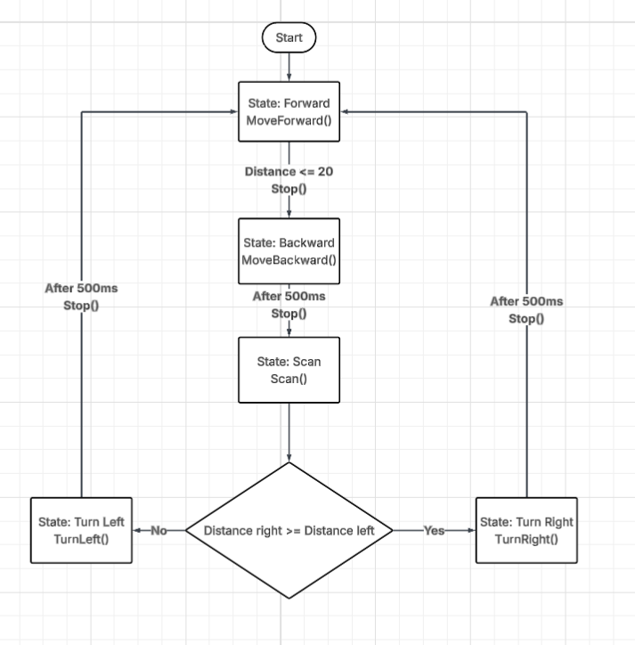
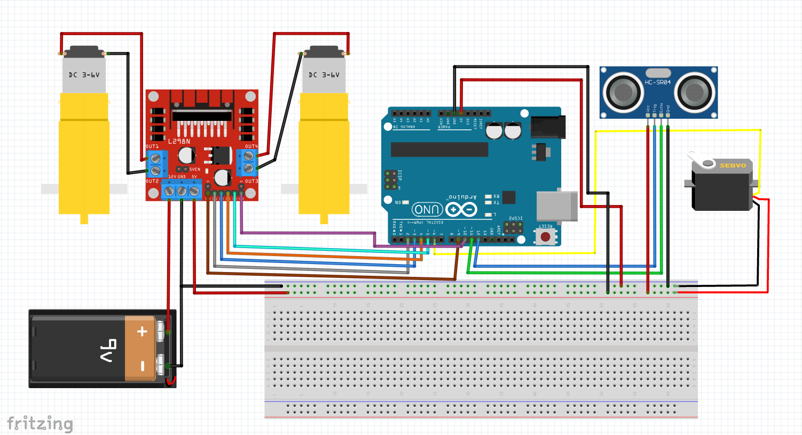

# 🤖 Obstacle Avoiding Robot Car

An Arduino-based autonomous robot car that detects obstacles using ultrasonic sensor and able to choose another route to avoid collision.

# Note
This project was developed using Platform IO in visual Studio Code.

If you are using Arduino IDE, you can still run this project:
    + open the "src" folder.
    + copy the code inside "main.cpp" file and paste into a new sketch in Arduino IDE.
    + install all the required libraries listed below.
    + select your Arduino board and upload the code normally.

# Project overview
This project is an obstacle avoiding car built with Arduino, ultrasonic sensor, servo motor, DC motot, and motor driver.

The robot continuously moves forward until an obstacle is detected by the sensor. When the distance is below the limit distance, it stops, moves backward and scan both sides to find a clearer path and turns toward that direction.

# Features
+ Obstacle detection using HC-SR04 ultrasonic sensor
+ Servo scanning left and right
+ Automatic direction decision
+ L298N motor driver control
+ State machine based robot behaviour
+ PlatformIO project structure

# Hardware
+ Arduino Uno
+ HC-SR04 Ultrasonic sensor
+ L298N Motor driver
+ 2 DC motors
+ Servo motor (SG90 or any small servo)
+ Battery pack (6V to 9V)
+ Jumper wires
+ Breadboard

# Software
+ VS Code
+ PlatformIO

# Libraries
+ <Arduino.h>
+ <Servo.h>
+ <NewPing.h>
+ <L298N.h>

# System design (state flow diagram)

# Wiring diagram

## How to Use
For Platform IO
    + Open the project in Visual Studio Code with the PlatformIO extension installed.
    + Build and upload the project directly.
For Arduino IDE
    + Copy the code from "src/main.cpp" into a new Arduino sketch, install the required libraries, then upload the sketch.

# What I learned 
+ How to control DC motors using L298N motor driver
+ How to use ultrasonic sensor 
+ How to use servo
+ How to design a basic state machine

# Errors and lesson learned
+ Testing DC motor direction before instalation as this had to be tested manually
+ Robot turned in wrong direction: this problem might appear if right and left distance were not stored correctly or the sensor not working properly.
+ Robot does not move straight forward: this happens mean the two DC motors may have different speeds. Try to replace another motor that match the speed or change the speed of the motor in the code (I have commented out in the max speed setup)
